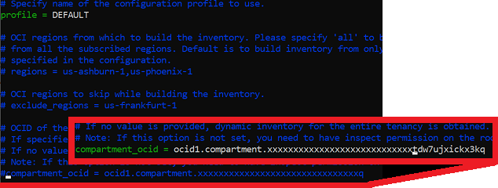
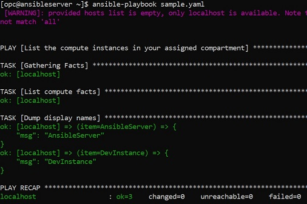

#  Managing Infrastructure with Ansible on OCI

## Introduction

Today, the **Infrastructure as Code** paradigm is a norm for DevOps professionals, and Ansible is one of the leading tools that enables this paradigm. Ansible is great; not just for configuration management, but also for infrastructure provisioning and orchestration. And yet, have you ever wondered how to really use Ansible to manage your cloud infrastructure at scale?

This lab will demonstrate both provisioning and configuration of your infrastructure. You will first provision a set of infrastructure resources with a single Ansible playbook. Next, you will leverage Ansible's *Dynamic Inventory* functionality to fetch the details of the current infrastructure and deploy Apache (the configuration management aspect). You would be doing all of it using your Ansible playbooks, leveraging the ‘Infrastructure as code’ paradigm.

  **Note:** The OCI UI is regularly being enhanced.  Therefore, some screenshots in the instructions might be different than actual user interface.

## **Step 1:** Getting started with Ansible
In this section we will download sample Ansible resources and configure it to work with our OCI tenancy. Before starting this section, make sure you have cloud shell open as you executed in the previous section.

1. Download and unzip the sample files.

    ```
    <copy>
    wget https://objectstorage.us-ashburn-1.oraclecloud.com/p/LG9tAGM2XJghv_CYDsXOhbnS-3Qf4kTjFisIJnQl__LFXbzPtU3hzGHugAgl8tUQ/n/c4u03/b/oci-library/o/oci_ansible.zip
    unzip oci_ansible.zip
    </copy>
    ```

2. Ansible will use your CLI credentials to authenticate and authorize access to OCI.  You will need to configure details of which compartment, region and compute shape.  Modify the **env-vars** file to update these values.

**NOTE:** You need to find your compartment OCID and your Availability Domain ID. If running in Ashburn instead of Phoenix, just move the **#** to comment out the line for the region you are not using.

    ````
    <copy>
    vi env_vars
    </copy>
    ````


    ```
    <copy>
    # OCID of assigned compartment
    export compartment_ocid=[your compartment id goes here - without square brackets]

    #Ashburn
    #export image_ocid=ocid1.image.oc1.iad.aaaaaaaayuihpsm2nfkxztdkottbjtfjqhgod7hfuirt2rqlewxrmdlgg75q

    #Phoenix
    export image_ocid=ocid1.image.oc1.phx.aaaaaaaadtmpmfm77czi5ghi5zh7uvkguu6dsecsg7kuo3eigc5663und4za

    # skip host verification prompts for demo
    export ANSIBLE_HOST_KEY_CHECKING=False
    export ad_name=[enter your AD ID here - whitout the square bracktes]
    export SAMPLE_INSTANCE_SHAPE=[your VM Shape here - without square brackets]
    </copy>
    ```

    This is an example of how your file will look like:

    ```
    # OCID of assigned compartment
    export compartment_ocid=ocid1.compartment.oc1..aaaaaaaaz4sb43ou4icnt4ddqjt6fmciobic657xvtott26ll5dw7xiw4tga

    # Oracle-Linux-7.7-2019.08-28-0
    #Ashburn
    #export image_ocid=ocid1.image.oc1.iad.aaaaaaaayuihpsm2nfkxztdkottbjtfjqhgod7hfuirt2rqlewxrmdlgg75q

    #Phoenix
    export image_ocid=ocid1.image.oc1.phx.aaaaaaaadtmpmfm77czi5ghi5zh7uvkguu6dsecsg7kuo3eigc5663und4za

    # skip host verification prompts for demo
    export ANSIBLE_HOST_KEY_CHECKING=False

    export ad_name=GrCh:PHX-AD-1
    export SAMPLE_INSTANCE_SHAPE=VM.Standard.E2.1
    ```

3. Save and exit the file.
    
	```
    <copy>
    :wq
    </copy>
    ```
    
4. Load the variables in the above file into ENV

    ```
    <copy>
    source env_vars
    </copy>
    ```

5. You will also need to update the ``oci_inventory.ini`` file for the dynamic inventory script.  Uncomment the compartment setting and replace the value with your compartment ocid.
    

6. Run the first sample playbook.  This will list some information about any compute resources you have in the compartment (should be the one you are using right now).

    ```
    <copy>
    ansible-playbook sample.yaml
    </copy>
    ```
    

7. If the output is devoid of errors, it is time to deploy our sample infrastructure.

    ```
    <copy>
    ansible-playbook instance_pool_example.yaml
    </copy>
    ```

    **NOTE:** This will take about 5 minutes to provision the network and compute resources.  You can navigate to *Instance Pools* in the OCI Management Console to watch the resources if you'd like.  

8. When the playbook execution is complete, see the output near the end for the public IP address of the instance that was provisioned.  Copy the IP address.

9.  Open a new tab in the web browser and paste in the IP address; press enter.  You should encounter an error because nothing has been installed on the server yet.  Proceed to the next section.


## **Step 4:** Deploying applications and code with Ansible
Now that we have provisioned our infrastructure, it is time to deploy an application (Apache) and some code (a simple HTML page).

1. Return to your SSH terminal session.

2. Run the following command to deploy and configure Apache on each server in the instance pool.

    ```
    <copy>
    ANSIBLE_INVENTORY=./oci_inventory.py ansible-playbook -u opc --become provision_web_server.yaml
    </copy>
    ```

3. After this completes (about 10 seconds) return to your web browser and refresh the sample web server page from earlier. It should now display *Configured by Ansible*.

### Challenge
In this tutorial, Ansible is deploying a simple HTML page. You can make modifications to the page and run the command in step 2 to deploy the "new code".

When finished, refresh your browser to see the changes.

## **Step 4:** Cleaning up your environment
In this exercise, all of the resources provisioned by Ansible were also tagged. The sample ``teardown.yaml`` script leverages these tags to find and destroy all the resources that were created.

1. Run the following command to remove all the resources.

    ```
    <copy>
    ansible-playbook teardown.yaml
    </copy>
    ```

2. It should take 3-5 minutes to complete.

3. You did it!  Feel free to explore the code or repeat the steps above once more if you have time.

## Acknowledgements
*Congratulations! You have successfully completed the lab.*

- **Author** - Flavio Pereira
- **Adapted by** -  Yaisah Granillo, Cloud Solution Engineer
- **Last Updated By/Date** - Rajeshwari Rai, February 2021
- **Workshop (or Lab) Expiry Date** - October 2021

## Need Help?
Please submit feedback or ask for help using our [LiveLabs Support Forum](https://community.oracle.com/tech/developers/categories/oracle-cloud-infrastructure-fundamentals). Please click the **Log In** button and login using your Oracle Account. Click the **Ask A Question** button to the left to start a *New Discussion* or *Ask a Question*.  Please include your workshop name and lab name.  You can also include screenshots and attach files.  Engage directly with the author of the workshop.

If you do not have an Oracle Account, click [here](https://profile.oracle.com/myprofile/account/create-account.jspx) to create one.
